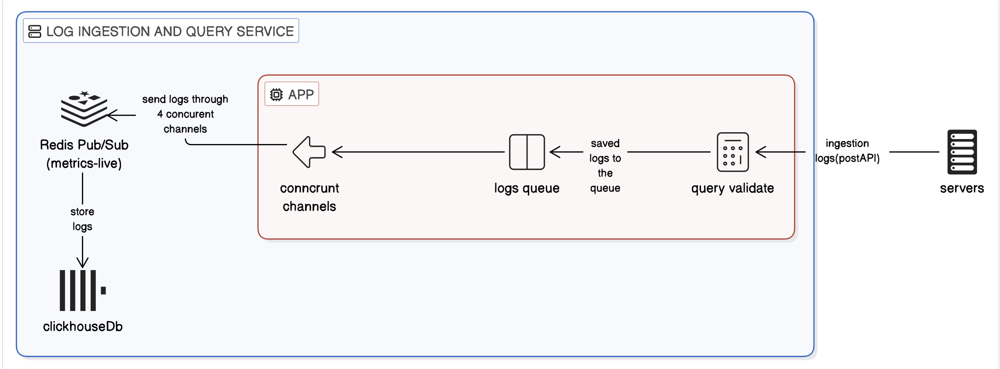
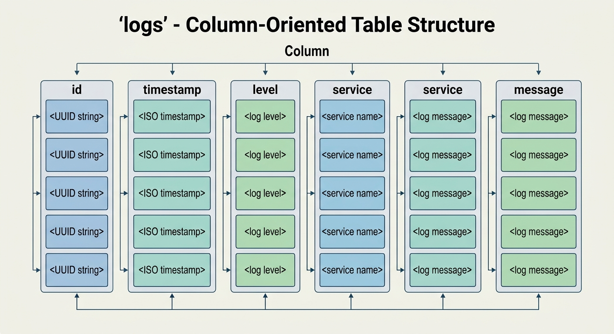

# Log Ingestion and Query Service

A high-throughput structured log ingestion and query service built with TypeScript, Express, Redis/BullMQ, and ClickHouse.

The service provides:

- **Store logs from different services**
- **Handle high-volume log ingestion reliably**
- **Query and filter logs by service, level, time range, and other attributes**
- **Aggregate logs over configurable time intervals**

---

## Architecture Overview

The final implementation uses a queue-based ingestion pipeline:

The service uses an **asynchronous, queue-based ingestion architecture** to decouple log ingestion from persistent storage.

!image.png

### Components

- **Ingestion API:** Servers submit log entries through the `POST /logs` endpoint. The API validates the incoming entries and enqueues valid logs for asynchronous processing.
- **Concurrent Workers:** Workers consume queued jobs concurrently and control the number of writes performed against ClickHouse. This prevents the database from
- **Batch Processing:** Workers accumulate multiple log entries into batches and perform bulk inserts into ClickHouse. Batch insertion reduces per-record database overhead and improves ingestion throughput.being directly exposed to the full concurrency of incoming API requests.
- **Redis Queue:** Redis acts as an intermediate queue between the API and ClickHouse. Once logs are successfully enqueued, the API can acknowledge the request. The queue also provides a buffer during temporary increases in traffic.
- **ClickHouse:** ClickHouse is used as the persistent storage layer because its column-oriented architecture is well suited to high-volume log ingestion and analytical workloads, particularly time-range filtering, grouping, and aggregation over large datasets.

---

# Setup Instructions

## Prerequisites

- Docker
- Docker Compose
- Git

The project is designed to run using Docker Compose.

```bash
git clone "https://github.com/showq0/log_ingestion-and-query-service"
cd <your project-directory>
docker compose up --build
```

application container is exposed through `localhost:8080`. 

**Health Check:**  `curl http://localhost:8080/health`

Expected result:`HTTP 200`

---

# API Documentation

## GET `/health`

Returns the service health status.

**Request:** GET `/health`

**Response:** 200 OK

---

## POST `/logs`

Ingests a batch of logs.

**Request :**  `POST /logsContent-Type: application/json`

**Example:**

```json
{
  "logs": [
    {
      "timestamp": "2026-07-20T14:32:01.123Z",
      "level": "error",
      "service": "checkout",
      "message": "payment declined",
      "attributes": {
        "user_id": "42",
        "region": "eu-west",
        "retries": 3
      }
    }
  ]
}
```


**Each entry must satisfy:**

- `timestamp` must be a valid ISO 8601 timestamp & cannot be more than five minutes in the future
- `level` must be `debug`, `info`, `warn`, or `error`
- `service` must be non-empty
- `message` must be non-empty
- `attributes` must be a flat object
- Nested objects and arrays are not accepted

**Successful Response** `200`

```json
{
  "accepted": 9,
  "rejected": [
    {
      "index": 3,
      "reason": "invalid level: 'critical'"
    }
  ]
}
```

**Failed Response 400** 

```sql
{
  error: "The request body contains malformed JSON",
}
```

---

## GET `/logs`

Filter stored logs based on query parameter.

**query parameter: service** (Exact service-name match), **level**(log-level), **since, until, attr.<key>,q** (substring search on message),**limit, cursor:** pagination cursor

All query parameters are optional and can be combined as this:

```
GET /logs?service=checkout&level=error&since=2026-07-20T14:00:00Z&until=2026-07-20T15:00:00Z&limit=100
```

**Response**

```json
{
  "logs": [
    {
      "id": "123",
      "timestamp": "2026-07-20T14:32:01.123Z",
      "level": "error",
      "service": "checkout",
      "message": "payment declined",
      "attributes": {
        "user_id": "42"
      }
    }
  ],
  "next_cursor": null
}
```

```json
{
  "error": "description"
}
```

---

# GET `/logs/aggregate`

Divides the specified time range into fixed intervals (buckets) such as **1 minute, 5 minutes, 1 hour, or 1 day**, then aggregates the matching logs within each interval and *optionally* groups the results by service or another supported dimension.

### parameter:

**Required:** `since` ,`until` ,`bucket` (`1m` ,`5m` ,`1h` ,`1d`)

**optionally group by:** `group_by` (`group_by=service` ,`group_by=level`)

**optionally **filters by** :`service`  ,`level` ,`attr.<key>` , `q`

Example:

```
GET /logs/aggregate?since=2026-07-20T14:00:00Z&until=2026-07-20T15:00:00Z&bucket=1m&group_by=service
```
Example response:

```json
{
  "buckets": [
    {
      "start": "2026-07-20T14:00:00Z",
      "group": "checkout",
      "count": 118
    },
    {
      "start": "2026-07-20T14:01:00Z",
      "group": "checkout",
      "count": 97
    }
  ]
}
```
---

# Schema Design

The final storage model is optimized around the workload’s dominant access pattern: **time-series log ingestion and time-range aggregation**.



**MergeTree** was selected because the system needs high-volume log ingestion and aggregation queries under 1 second. It handles inserts efficiently through background merging, while columnar storage and the sparse index reduce the data scanned during filtered aggregations.

**ORDER BY (timestamp, id)** was chosen to prioritize time-range filtering, which is the primary access pattern for log queries. `timestamp` allows ClickHouse to skip irrelevant data granules, while `id` provides deterministic ordering for stable cursor-based pagination. This reduces the amount of data scanned.

**Attribute Storage Strategy:** Attributes are stored as a flexible key/value structure because their keys and values can vary between log records. Using a fixed column for each possible attribute would require schema changes whenever a new attribute is introduced. Storing the attributes as a JSON-like structure preserves this flexibility while supporting dynamic filtering through attr.<key>=<value>.

---

## Version 1 — PostgreSQL

The initial implementation used **PostgreSQL** as the primary storage database.

Under high ingestion load, PostgreSQL became the primary bottleneck:

| Postgres Cpu (max) | Postgres Cpu (avg) | Postgres Memory (max) | Postgres Memory (avg) |
| --- | --- | --- | --- |
| 104.10% | 79.93% | 226.80 MiB | 209.02 Мів |

The application remained stable, but the database became saturated under the ingestion workload. This indicates that the primary bottleneck was at the **database layer**, resulting in only **684 logs/sec throughput** and a **21,184 ms p95 ingestion latency**.

Analytical **aggregation queries** were also significantly impacted, reaching a **23,932 ms p95 latency**, which failed the requirement for sub-second aggregation performance.

---

# Version 2 — TimescaleDB

Store data according to the dimension by which it is predominantly queried.

The second implementation introduced **TimescaleDB** to optimize PostgreSQL for the time-series characteristics of the log workload. because logs were primarily queried by **time range**, so the data was physically organized around the `timestamp` dimension. A TimescaleDB hypertable presents a standard table interface while internally partitioning data into **time-based chunks**. Queries with time constraints can use **chunk exclusion** to avoid scanning chunks outside the requested time range.

The implementation also added:

- **Service-based partitioning** to improve data locality for service-specific queries.
- **Indexes on `service`** to accelerate service filtering.

### Results

| Metric | **Ingestion p95** | **Throughput** | **Aggregation p95** | **Total** |
| --- | --- | --- | --- | --- |
| Result | 1,211 ms | 12,474 logs/sec | 1,211 ms | **71.1 / 100** |

TimescaleDB significantly improved ingestion performance, increasing throughput from **684 logs/sec to 12,474 logs/sec** compared with the original PostgreSQL implementation.

However, **aggregation performance remained above the 1-second p95 target**, with an observed p95 of **1,282 ms**. This showed that time-based partitioning improved ingestion and time-range filtering, but the workload still required a storage engine better optimized for **large-scale analytical aggregations**.

Pre-Aggregation with TimescaleDB

I also try evaluated **pre-aggregation** in TimescaleDB to reduce the cost of repeated aggregation queries. The approach maintained aggregated data for predefined time buckets, allowing queries to read summarized data instead of scanning the raw log records. the benefit was limited when queries used different filters or grouping combinations, because each variation required additional pre-aggregated data or fell back to querying the raw logs. it was not flexible enough for our workload.

---

# Version 3 — ClickHouse + Queue

The final implementation changed the storage engine to ClickHouse and introduced a queue-based ingestion architecture.

**ClickHouse was selected because the remaining bottleneck was analytical query performance.** PostgreSQL and TimescaleDB improved ingestion, but aggregation p95 remained above the 1-second requirement. ClickHouse's columnar storage and MergeTree-based data organization are better suited to scanning and aggregating large volumes of log data, reducing the amount of data processed by analytical queries.

**Redis/BullMQ was introduced to separate ingestion from storage.** Instead of making every HTTP request perform a database write, logs are queued and processed by workers in controlled batches. This reduces database write overhead, provides backpressure during ingestion spikes, and allows ingestion concurrency to be tuned independently from the API.

Because ClickHouse was constrained to 1 GB of memory, ingestion needed to be controlled rather than sending an unrestricted stream of writes directly to the database. BullMQ provides buffering, while workers control concurrency and batch size, allowing ClickHouse to process the workload within its resource limit.

**The results validated these design decisions:** throughput increased to **13,379 logs/sec** while maintaining **0% errors** and **20/20 reliability scenarios**, and aggregation p95 decreased to **162 ms**, comfortably meeting the **1-second target**. This improved throughput and query performance without compromising system consistency and reliability.

---
# Version 3 Performance

The final measured result was:

Compared with Version 1:

| Metric | PostgreSQL | TimescaleDB | ClickHouse + Queue |
| --- | --- | --- | --- |
| Throughput | 684/s | 12,474/s | **13,379/s** |
| Ingestion p95 | 21,184 ms | 1,211 ms | 1,549 ms |
| Aggregate p95 | 23,932 ms | 1,282 ms | **162 ms** |
| Errors | 0.0% | 0.0% | 0.0% |
| Reliability | 0/4 | 0/4 | 4/4 |
| Total | 47 | 71.1 | **78.4** |

---

# Load-Test Methodology

The benchmark was used not only to measure raw performance, but to evaluate how **architectural changes affect the system as a whole**.

A change that improves one metric can negatively affect another. For example, increasing ingestion concurrency may improve throughput but increase database contention and latency, while aggressive pre-aggregation may improve some queries but reduce flexibility or consistency.

Therefore, each architecture was evaluated across **throughput, latency, correctness, consistency, error rate, and reliability**. The goal was not simply to achieve the highest possible throughput, but to find a balanced design that provides **high and sustained performance while maintaining strong correctness, consistency, and reliability**.

This approach allowed the benchmark results to guide architectural decisions based on **measured system behavior rather than isolated performance improvements**.

---

# Bottlenecks Discovered

## Version 1

The primary bottleneck was PostgreSQL.

throughput is 684 logs/s while sending 15k/sec and aggregate p95: 23932 ms as the same time (db CPU max) was 104.10% 

*The database was responsible for both ingestion and analytical query processing, creating significant contention.*

---

## Version 2

Aggregation query performance remained the primary bottleneck. The measured aggregation **p95 latency was 1,282 ms**, which improved significantly compared with Version 1 but still exceeded the required **<1 second p95** target.

---

## **Known Limitations**

**Limitation:** Newly accepted logs may not be immediately available for querying.

**Why:** Logs are processed asynchronously through Redis/BullMQ before being inserted into ClickHouse.

---

**Effect:** There can be a short delay between accepting a log and making it queryable.

**Limitation:** Performance is constrained by the available resources.

**Why:** The benchmark runs with a defined CPU and 1 GB ClickHouse memory limit

**Effect:** Higher ingestion rates may require additional resources or tuning.

---

# Design Trade-offs

### PostgreSQL

**Advantages**

- Strong consistency
- Flexible querying

**Disadvantages**

- Insert workload and analytical queries compete for resources
- High CPU utilization under ingestion
- Poor aggregate latency under the benchmark workload

---
### TimescaleDB

**Advantages**

- Time-series-oriented storage
- Time-based chunks
- Chunk exclusion
- Better ingestion throughput than standard PostgreSQL

**Disadvantages**

- Aggregate latency remained above the one-second p95 target
---

### ClickHouse + Queue

**Advantages**

- Column-oriented analytical storage
- Very fast aggregation
- Efficient bulk ingestion
- Queue-based load isolation
- Controlled worker concurrency
- Best overall benchmark score

**Disadvantages**

- More infrastructure
- Eventual visibility through asynchronous ingestion
- Throughput still measured below 15,000 logs/sec

---

# Conclusion
Each architectural change addressed a measured bottleneck, resulting in a final design that balances high ingestion throughput, sub-second aggregation latency, correctness, consistency, and reliability.
The final system achieved:

- **13,379 logs/sec throughput**
- **0.0% measured errors**
- **162 ms aggregate p95**
- **4/4 reliability scenarios**
- **78.4/100 total benchmark score**